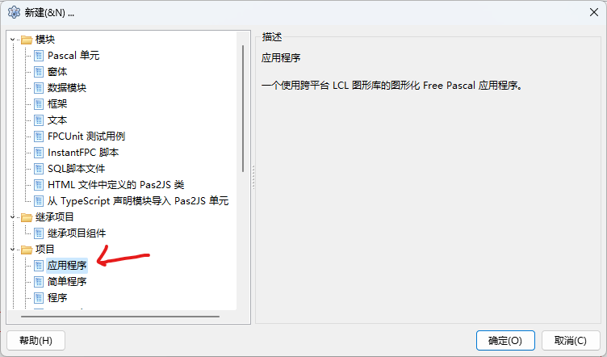
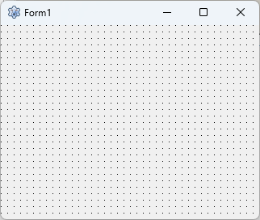
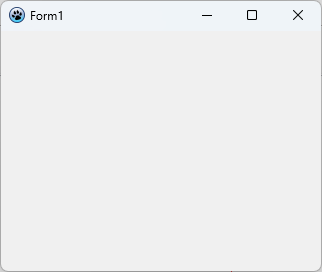
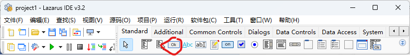
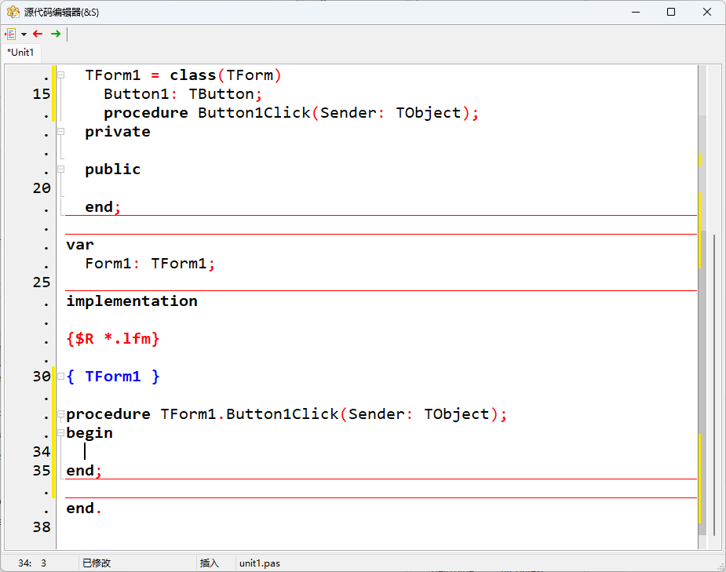
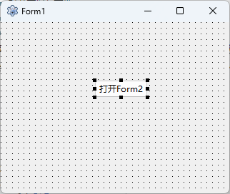
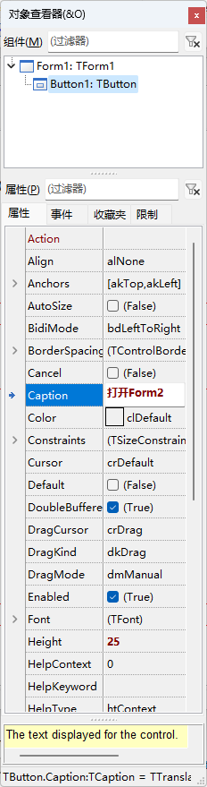

# 创建一个简单Lazarus窗体应用

## 窗体是什么?

form表示应用程序的用户界面的窗口或对话框。它是所有其他组件（例如按钮，标签，编辑字段，图像等）的容器。

## 第一个GUI应用程序

安装完成之后，通过菜单栏 文件 -> 新建 -> 项目 -> 应用程序 就可以创建一个空白窗口程序

直接按下F9按键、点击图标、或者点击菜单栏 运行 -> 运行，项目就会编译和运行。

没有什么真正令人兴奋的事情发生。form(Form1)在外观上略有变化，栅格中的点(有助于单个组件的定位)消失了(只要栅格点是可见的，你就知道它仍处于设计模式)

接下来，你可以在表单上放置一个按钮。稍后将使用它来打开第二个form:从控件盘的Standard选项卡中选择TButton。

## 第二个窗体的使用

### Show 和 ShowModal(模态)的区别

## 两个窗体能够互相调用

## Passing Variables to Other Forms

## Other Form-Related Subjects

### Use Another Form as the Main Form

### Save properties of the shape at end of program

## Generate the form dynamically

### Create a Lazarus designed form dynamically

### Creating a new form dynamically

